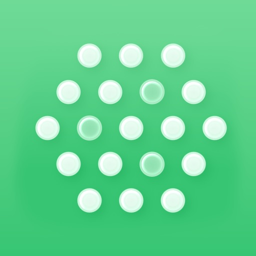
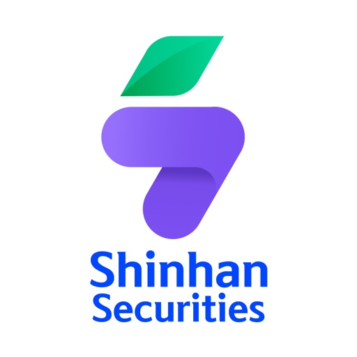
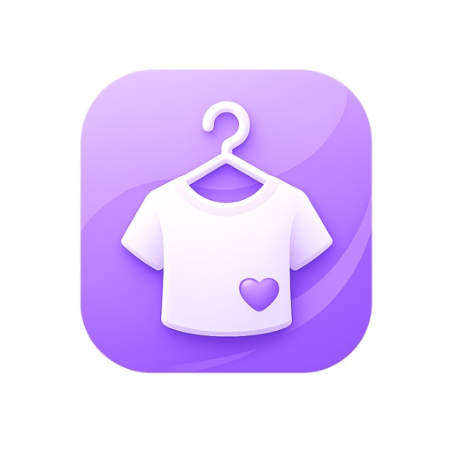
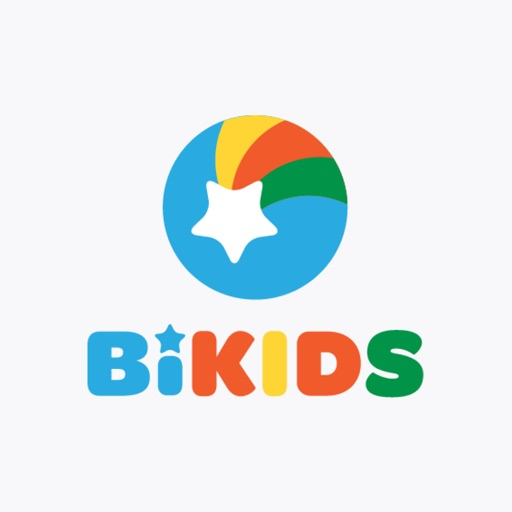

<div align="center">


[](https://git.io/typing-svg)

<p>
  
  
  
</p>

<p>
  <a href="mailto:trong.doanngoc2023@gmail.com"></a>
  <a href="https://linkedin.com/in/trongdoanngocdev01"></a>
  <a href="https://portfolio-dnt.vercel.app"></a>
</p>

</div>

---

## About Me

Frontend developer with **4 years** in ReactJS and React Native. Currently shipping **[HD Invest](https://apps.apple.com/vn/app/hd-invest/id6739621627?l=vi)** at **HD Securities**.

Fintech (HD Invest, SanXinHa, Nami) · Healthcare (Vinmec EMR) · EdTech (BiEdu / Bikids) · Indie ([HomeMind](https://apps.apple.com/app/id6779894095)).

I use AI (Cursor, MCP, Figma) to ship faster — still review, still keep quality.

```ts
const trongDN = {
  now: "HD Securities · HD Invest",
  stack: ["React Native", "React", "TypeScript", "Expo"],
  ship: "production apps on App Store & Play Store",
};
```

---

## Experience

|                                                                               | Period                  | Company                        | What I shipped                                                                                                                                                                               |
| ----------------------------------------------------------------------------- | ----------------------- | ------------------------------ | -------------------------------------------------------------------------------------------------------------------------------------------------------------------------------------------- |
|        | **Jun 2026 – Present**  | **HD Securities (HDS)**        | [HD Invest](https://apps.apple.com/vn/app/hd-invest/id6739621627?l=vi) · [Play Store](https://play.google.com/store/apps/details?id=vn.hd.invest&hl=vi) — eKYC NFC, orders, market, research |
|  | **Nov 2025 – Jun 2026** | **VinSmart Future · Vingroup** | Vinmec EMR — digital patient records & clinical workflows                                                                                                                                    |
|            | **Feb 2025 – Nov 2025** | **Shinhan Securities Vietnam** | SanXinHa — realtime market, eKYC, AI chatbot                                                                                                                                                 |
|  | **Sep 2023 – Nov 2024** | **Bitech**                     | BiEdu & Bikids — education web + mobile                                                                                                                                                      |
|           | **Oct 2022 – Feb 2023** | **Nami Exchange**              | Crypto trading app — UI rebuild, performance                                                                                                                                                 |

---

## Featured Work

<table>
  <tr>
    <td width="50%" valign="top">
      
      <h3>HD Invest</h3>
      <p> <b>HD Securities · Jun 2026 – Present</b></p>
      <p>Trading app: 3-minute eKYC via NFC CCCD, live market, order book, loan/rights, NAV, FinAlpha research.</p>
      <table>
        <tr>
          <td valign="middle">
            <a href="https://apps.apple.com/vn/app/hd-invest/id6739621627?l=vi"></a>
          </td>
          <td valign="middle">
            <a href="https://play.google.com/store/apps/details?id=vn.hd.invest&hl=vi"></a>
          </td>
        </tr>
      </table>
    </td>
    <td width="50%" valign="top">
      
      <h3>SanXinHa</h3>
      <p> <b>Shinhan Securities · Feb 2025 – Nov 2025</b></p>
      <p>Realtime KRX socket, Zustand + React Query, OCR/NFC/FaceID eKYC, AI chatbot + FireAnt news.</p>
      <table>
        <tr>
          <td valign="middle">
            <a href="https://apps.apple.com/vn/app/san-xin-ha/id1645490037"></a>
          </td>
          <td valign="middle">
            <a href="https://play.google.com/store/apps/details?id=vn.ssv.sanxinha"></a>
          </td>
        </tr>
      </table>
    </td>
  </tr>
  <tr>
    <td width="50%" valign="top">
      
      <h3>Vinmec EMR</h3>
      <p><b>VinSmart Future · Vingroup · Nov 2025 – Jun 2026</b></p>
      <p>EMR for doctors & staff: exam, diagnosis, prescription, lab/imaging orders, treatment tracking.</p>
    </td>
    <td width="50%" valign="top">
      
      <h3>HomeMind</h3>
      <p><b>Indie product · Owner</b></p>
      <p>Lifestyle app: home zones, wardrobe, AI outfits, family memories & Crush space. Live on stores (v1.0.8).</p>
      <table>
        <tr>
          <td valign="middle">
            <a href="https://apps.apple.com/app/id6779894095"></a>
          </td>
          <td valign="middle">
            <a href="https://play.google.com/store/apps/details?id=app.homemind"></a>
          </td>
        </tr>
      </table>
    </td>
  </tr>
  <tr>
    <td width="50%" valign="top">
      
      
      <h3>BiEdu & Bikids</h3>
      <p> <b>Bitech · Sep 2023 – Nov 2024</b></p>
      <p>Education platforms (web + mobile). Lazy loading, code splitting, caching. Reusable UI + docs.</p>
      <table>
        <tr>
          <td valign="middle">
            <a href="https://apps.apple.com/vn/app/biedu/id6450730295"></a>
          </td>
          <td valign="middle">
            <a href="https://bi-edu.bitechco.com"></a>
          </td>
          <td valign="middle">
            <a href="https://bikids.edu.vn"></a>
          </td>
        </tr>
      </table>
    </td>
    <td width="50%" valign="top">
      
      <h3>Nami Exchange</h3>
      <p><b>Nami Exchange · Oct 2022 – Feb 2023</b></p>
      <p>Rebuilt trading UI, improved performance, shipped defect fixes on a multi-platform crypto exchange.</p>
      <table>
        <tr>
          <td valign="middle">
            <a href="https://apps.apple.com/app/nami-exchange-buy-btc-crypto/id1480302334"></a>
          </td>
          <td valign="middle">
            <a href="https://play.google.com/store/apps/details?id=com.namicorp.exchange"></a>
          </td>
        </tr>
      </table>
    </td>
  </tr>
</table>

---

## Tech Stack

<p align="center">
  
</p>

**Frontend** — ReactJS · React Native · Next.js · Expo  
**Language** — TypeScript · JavaScript  
**UI** — HTML5 · CSS/SCSS · Tailwind · Ant Design · MUI · Figma  
**State / Data** — Redux · Zustand · React Query · Firebase · Supabase · Socket.io  
**Backend / DB** — Node.js · MySQL · MongoDB  
**Process** — Git · Jira · Agile/Scrum  
**AI tools** — Cursor (Rules, Context7, MCP with Figma / Claude / Slack)

---

## GitHub Stats

<div align="center">


<br/><br/>


<br/><br/>


<br/>


<br/><br/>


</div>

---

## Weekly Coding Stats

<!--START_SECTION:waka-->
```text
From: 12 August 2026 - To: 19 August 2026

Total Time: 25 hrs 11 mins

TypeScript    12 hrs 1 mins ███████████░░░░░░░░░░░░░   47.77 %
JSON          5 hrs 28 mins █████░░░░░░░░░░░░░░░░░░░   21.74 %
Markdown      1 hrs 50 mins ██░░░░░░░░░░░░░░░░░░░░░░    7.32 %
Other         1 hrs 9 mins  █░░░░░░░░░░░░░░░░░░░░░░░    4.57 %
JavaScript    1 hrs 1 mins  █░░░░░░░░░░░░░░░░░░░░░░░    4.07 %
Text          53 mins       █░░░░░░░░░░░░░░░░░░░░░░░    3.55 %
Dart          35 mins       █░░░░░░░░░░░░░░░░░░░░░░░    2.33 %
Image (png)   26 mins       ░░░░░░░░░░░░░░░░░░░░░░░░    1.76 %
```
<!--END_SECTION:waka-->

---

## Side Projects

<div align="center">

[](https://github.com/TrongDoanNgoc/nodebase)
[](https://github.com/TrongDoanNgoc/portfolio-dnt)

</div>

---

## Let's Connect

<div align="center">

[](mailto:trong.doanngoc2023@gmail.com)
[](https://linkedin.com/in/trongdoanngocdev01)
[](https://portfolio-dnt.vercel.app)
[](https://apps.apple.com/vn/app/hd-invest/id6739621627?l=vi)
[](https://apps.apple.com/app/id6779894095)

<br/><br/>


</div>


