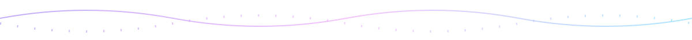
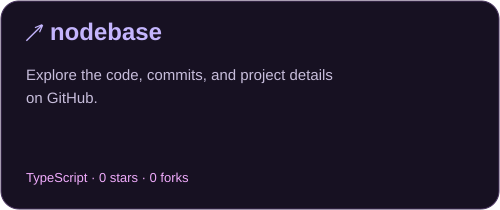
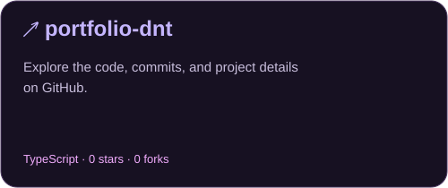
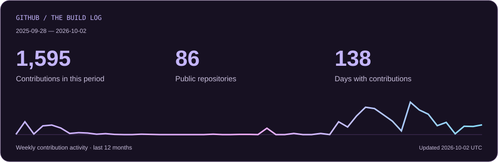
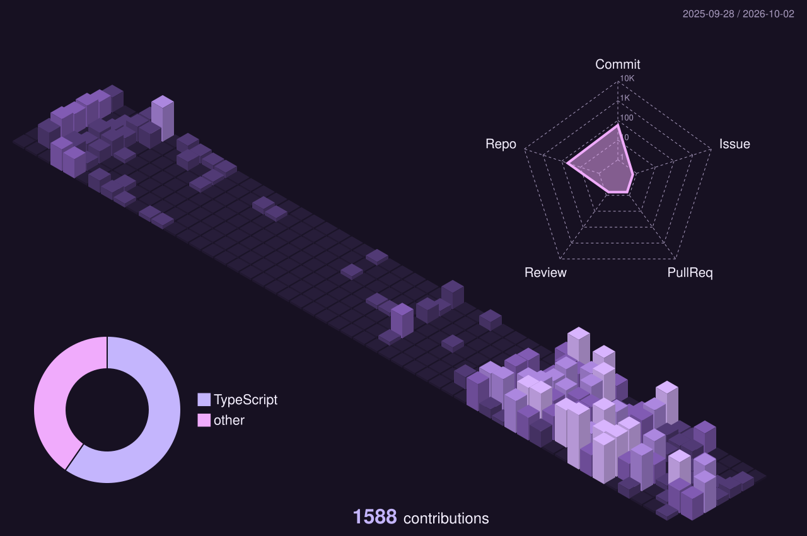
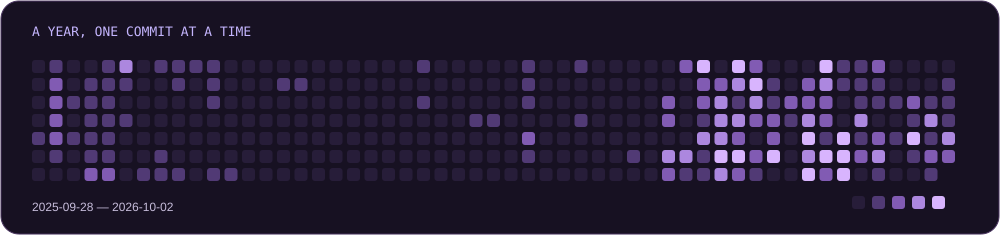

<picture>
  <source media="(prefers-reduced-motion: reduce) and (max-width: 600px)" srcset="assets/static/header-mobile.svg" />
  <source media="(prefers-reduced-motion: reduce)" srcset="assets/static/header.svg" />
  <source media="(max-width: 600px)" srcset="assets/header-mobile.svg" />
  
</picture>

<p align="center">
  <a href="https://portfolio-dnt.vercel.app"></a>
  <a href="https://linkedin.com/in/trongdoanngocdev01"></a>
  <a href="mailto:trong.doanngoc2023@gmail.com"></a>
</p>

<p align="center"><b>✦ Mobile engineer &nbsp; ✦ Web craftsman &nbsp; ✦ Indie builder</b></p>

<picture>
  <source media="(prefers-reduced-motion: reduce) and (max-width: 600px)" srcset="assets/static/terminal-mobile.svg" />
  <source media="(prefers-reduced-motion: reduce)" srcset="assets/static/terminal.svg" />
  <source media="(max-width: 600px)" srcset="assets/terminal-mobile.svg" />
  
</picture>

## Good products earn trust. Great interfaces keep it.

I'm **Trong**, a Mobile & Web Engineer working across **React Native, Flutter, React, and TypeScript**. I build interfaces for products where the details matter: placing a trade, navigating a patient record, or sharing a private moment.

Currently building **HD Invest at HD Securities**. My work spans financial services, healthcare, education, and my own indie product, **Private Nest**.

I care about the whole path to production: understandable architecture, responsive interactions, dependable data flows, and the small details that make software feel considered.

<picture>
  <source media="(prefers-reduced-motion: reduce)" srcset="assets/static/divider.svg" />
  
</picture>

## ✦ 01 / Selected work

Real products. Real workflows. Shipped to the people who use them.

<a href="https://apps.apple.com/vn/app/hd-invest/id6739621627?l=vi">
  <picture>
    <source media="(prefers-reduced-motion: reduce) and (max-width: 600px)" srcset="assets/static/work/hd-invest-mobile.svg" />
    <source media="(prefers-reduced-motion: reduce)" srcset="assets/static/work/hd-invest.svg" />
    <source media="(max-width: 600px)" srcset="assets/work/hd-invest-mobile.svg" />
    
  </picture>
</a>
<p align="right">
  <a href="https://apps.apple.com/vn/app/hd-invest/id6739621627?l=vi"></a>
  <a href="https://play.google.com/store/apps/details?id=vn.hd.invest&amp;hl=vi"></a>
</p>

<a href="https://apps.apple.com/vn/app/san-xin-ha/id1645490037">
  <picture>
    <source media="(prefers-reduced-motion: reduce) and (max-width: 600px)" srcset="assets/static/work/sanxinha-mobile.svg" />
    <source media="(prefers-reduced-motion: reduce)" srcset="assets/static/work/sanxinha.svg" />
    <source media="(max-width: 600px)" srcset="assets/work/sanxinha-mobile.svg" />
    
  </picture>
</a>
<p align="right">
  <a href="https://apps.apple.com/vn/app/san-xin-ha/id1645490037"></a>
  <a href="https://play.google.com/store/apps/details?id=vn.ssv.sanxinha"></a>
</p>

<picture>
  <source media="(prefers-reduced-motion: reduce) and (max-width: 600px)" srcset="assets/static/work/vinmec-mobile.svg" />
  <source media="(prefers-reduced-motion: reduce)" srcset="assets/static/work/vinmec.svg" />
  <source media="(max-width: 600px)" srcset="assets/work/vinmec-mobile.svg" />
  
</picture>

<br /><br />

<a href="https://apps.apple.com/vn/app/biedu/id6450730295">
  <picture>
    <source media="(prefers-reduced-motion: reduce) and (max-width: 600px)" srcset="assets/static/work/biedu-mobile.svg" />
    <source media="(prefers-reduced-motion: reduce)" srcset="assets/static/work/biedu.svg" />
    <source media="(max-width: 600px)" srcset="assets/work/biedu-mobile.svg" />
    
  </picture>
</a>
<p align="right">
  <a href="https://apps.apple.com/vn/app/biedu/id6450730295"></a>
  <a href="https://bi-edu.bitechco.com"></a>
  <a href="https://bikids.edu.vn"></a>
</p>

<a href="https://apps.apple.com/app/nami-exchange-buy-btc-crypto/id1480302334">
  <picture>
    <source media="(prefers-reduced-motion: reduce) and (max-width: 600px)" srcset="assets/static/work/nami-mobile.svg" />
    <source media="(prefers-reduced-motion: reduce)" srcset="assets/static/work/nami.svg" />
    <source media="(max-width: 600px)" srcset="assets/work/nami-mobile.svg" />
    
  </picture>
</a>
<p align="right">
  <a href="https://apps.apple.com/app/nami-exchange-buy-btc-crypto/id1480302334"></a>
  <a href="https://play.google.com/store/apps/details?id=com.namicorp.exchange"></a>
</p>

<a href="https://apps.apple.com/app/id6779894095">
  <picture>
    <source media="(prefers-reduced-motion: reduce) and (max-width: 600px)" srcset="assets/static/work/private-nest-mobile.svg" />
    <source media="(prefers-reduced-motion: reduce)" srcset="assets/static/work/private-nest.svg" />
    <source media="(max-width: 600px)" srcset="assets/work/private-nest-mobile.svg" />
    
  </picture>
</a>
<p align="right">
  <a href="https://apps.apple.com/app/id6779894095"></a>
  <a href="https://play.google.com/store/apps/details?id=app.homemind"></a>
</p>

<picture>
  <source media="(prefers-reduced-motion: reduce)" srcset="assets/static/divider.svg" />
  
</picture>

## ✧ 02 / How I approach the work

**Build for the interaction.** Loading, empty, error, and success states are all part of the product. Motion should make an interface easier to understand and satisfying to use.

**Make complexity manageable.** Clear component boundaries, reusable UI, and deliberate state and data flow keep a product easier to extend.

**Treat performance as a feature.** My work has included lazy loading, code splitting, caching, and improving trading interfaces. Fast feedback matters most when the task is complex.

**Own the last mile.** Implementation is one part of shipping. I care about the path from the design to a usable release, and use AI-assisted tooling with human review.

<picture>
  <source media="(prefers-reduced-motion: reduce)" srcset="assets/static/divider.svg" />
  
</picture>

## ❋ 03 / My toolkit

<p align="center">
  
</p>

| Focus | Tools I work with |
| :--- | :--- |
| **Mobile** | React Native · Expo · TypeScript · Flutter · Dart |
| **Web** | React · Next.js · JavaScript · HTML · CSS / SCSS |
| **UI & design** | Tailwind CSS · Ant Design · MUI · Figma |
| **State & realtime data** | Zustand · Redux · React Query · Socket.io |
| **Services & storage** | Firebase · Supabase · Node.js · MySQL · MongoDB |
| **Delivery** | Git · Jira · Agile / Scrum · Cursor · MCP |

<picture>
  <source media="(prefers-reduced-motion: reduce)" srcset="assets/static/divider.svg" />
  
</picture>

## ✦ 04 / The journey

| When | Where | Product focus |
| :--- | :--- | :--- |
| **Jun 2026 — Present** | **HD Securities** | HD Invest · mobile investing |
| Nov 2025 — Jun 2026 | VinSmart Future · Vingroup | Vinmec · clinical workflows |
| Feb 2025 — Nov 2025 | Shinhan Securities Vietnam | SanXinHa · securities trading |
| Sep 2023 — Nov 2024 | Bitech | BiEdu & Bikids · education |
| Oct 2022 — Feb 2023 | Nami Exchange | Crypto trading interfaces |

<picture>
  <source media="(prefers-reduced-motion: reduce)" srcset="assets/static/divider.svg" />
  
</picture>

## ✧ 05 / Beyond the day job

**[Private Nest](https://apps.apple.com/app/id6779894095)** is where I practice independent product ownership. You can also explore [nodebase](https://github.com/TrongDoanNgoc/nodebase) and the source for [my portfolio](https://github.com/TrongDoanNgoc/portfolio-dnt).

<p>
  <a href="https://github.com/TrongDoanNgoc/nodebase"></a>
  <a href="https://github.com/TrongDoanNgoc/portfolio-dnt"></a>
</p>

<picture>
  <source media="(prefers-reduced-motion: reduce)" srcset="assets/static/divider.svg" />
  
</picture>

## ❋ 06 / The GitHub playground

A little lavender, a lot of commits. Cards and contribution art refresh daily through GitHub Actions.

<a href="https://github.com/TrongDoanNgoc?tab=overview">
  <picture>
  <source media="(prefers-reduced-motion: reduce) and (max-width: 600px)" srcset="assets/static/github/activity-mobile.svg" />
  <source media="(prefers-reduced-motion: reduce)" srcset="assets/static/github/activity.svg" />
    <source media="(max-width: 600px)" srcset="assets/github/activity-mobile.svg" />
    
  </picture>
</a>

<!--START_SECTION:extensions-->

### A year in lavender / 3D contribution city

<picture>
  <source media="(prefers-reduced-motion: reduce)" srcset="assets/widgets/lavender-city-static.svg" />
  
</picture>

<sub>Generated with <a href="https://github.com/yoshi389111/github-profile-3d-contrib">GitHub Profile 3D Contrib</a>.</sub>

### Insert commit, start game / Galaga

<picture>
  <source media="(prefers-reduced-motion: reduce)" srcset="assets/github/contributions.svg" />
  
</picture>

<sub>Contribution replay powered by <a href="https://github.com/abozanona/pacman-contribution-graph">Arcade Contribution Graph</a>.</sub>

### The code behind the craft


<sub>Public repository language composition, not a measure of expertise. Generated with <a href="https://github.com/lowlighter/metrics">Metrics</a>.</sub>

<!--END_SECTION:extensions-->

<details>
<summary><b>More arcade / the original lavender snake 🐍</b></summary>

<picture>
  <source media="(prefers-reduced-motion: reduce)" srcset="assets/github/contributions.svg" />
  
</picture>

</details>

<details>
<summary><b>✦ See the original contribution garden</b></summary>



</details>

<details>
<summary><b>⌘ Under the hood / weekly coding activity</b></summary>

Activity for the date range below, updated by the repository's WakaTime workflow.

<!--START_SECTION:waka-->
```text
From: 01 October 2026 - To: 08 October 2026

Total Time: 28 hrs 32 mins

TypeScript   13 hrs 40 mins ████████████░░░░░░░░░░░░   47.92 %
Dart         5 hrs 2 mins   ████░░░░░░░░░░░░░░░░░░░░   17.70 %
Markdown     2 hrs 3 mins   ██░░░░░░░░░░░░░░░░░░░░░░    7.19 %
JSON         1 hrs 38 mins  █░░░░░░░░░░░░░░░░░░░░░░░    5.78 %
Other        1 hrs 20 mins  █░░░░░░░░░░░░░░░░░░░░░░░    4.70 %
Text         1 hrs 10 mins  █░░░░░░░░░░░░░░░░░░░░░░░    4.10 %
YAML         59 mins        █░░░░░░░░░░░░░░░░░░░░░░░    3.45 %
JavaScript   54 mins        █░░░░░░░░░░░░░░░░░░░░░░░    3.20 %
```
<!--END_SECTION:waka-->

</details>

<br />

<a href="mailto:trong.doanngoc2023@gmail.com">
  <picture>
  <source media="(prefers-reduced-motion: reduce) and (max-width: 600px)" srcset="assets/static/footer-mobile.svg" />
  <source media="(prefers-reduced-motion: reduce)" srcset="assets/static/footer.svg" />
    <source media="(max-width: 600px)" srcset="assets/footer-mobile.svg" />
    
  </picture>
</a>

<p align="center">
  <a href="mailto:trong.doanngoc2023@gmail.com">trong.doanngoc2023@gmail.com</a><br />
  <sub>Based in Ho Chi Minh City, Vietnam · Building for people, wherever they are.</sub>
</p>
