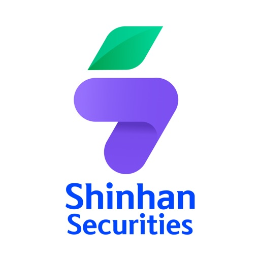
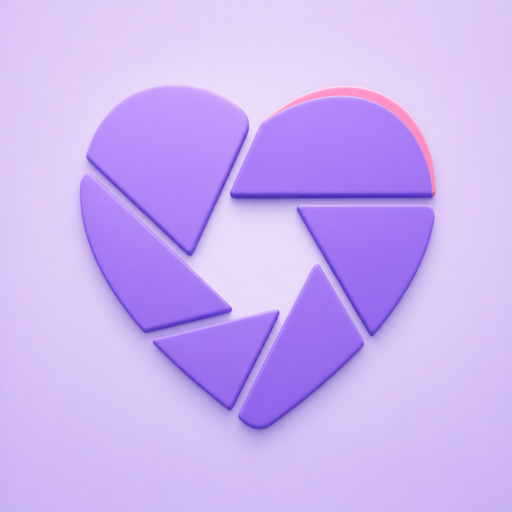

<picture>
  <source media="(max-width: 600px)" srcset="assets/header-mobile.svg" />
  
</picture>

<p align="center">
  <a href="https://portfolio-dnt.vercel.app"><b>Explore my portfolio ↗</b></a> &nbsp; / &nbsp;
  <a href="https://linkedin.com/in/trongdoanngocdev01">LinkedIn</a> &nbsp; / &nbsp;
  <a href="mailto:trong.doanngoc2023@gmail.com">Let's talk</a>
</p>

## Good products earn trust. Great interfaces keep it.

I'm **Trong**, a Mobile & Web Engineer working across **React Native, React, and TypeScript**. I build interfaces for products where the details matter: placing a trade, navigating a patient record, or sharing a private moment.

Currently building **HD Invest at HD Securities**. My work spans financial services, healthcare, education, and my own indie product, **Private Nest**.

I care about the whole path to production: understandable architecture, responsive interactions, dependable data flows, and the small details that make software feel considered.

<br />

## 01 / Selected work

Real products. Real workflows. Shipped to the people who use them.

###  &nbsp; HD Invest

**FINTECH · HD SECURITIES · MOBILE**

Trading workflows that connect identity, market data, and execution. My work covers **NFC-based eKYC, live markets, orders, portfolio NAV, and investment research**.

[App Store ↗](https://apps.apple.com/vn/app/hd-invest/id6739621627?l=vi) &nbsp; · &nbsp; [Google Play ↗](https://play.google.com/store/apps/details?id=vn.hd.invest&hl=vi)

---

###  &nbsp; SanXinHa

**FINTECH · SHINHAN SECURITIES VIETNAM · MOBILE**

A securities app with **realtime KRX market feeds**, OCR/NFC/FaceID identity verification, and an AI chatbot. Worked with **Zustand, React Query, socket-driven data, and FireAnt news** to bring complex financial workflows into the interface.

[App Store ↗](https://apps.apple.com/vn/app/san-xin-ha/id1645490037) &nbsp; · &nbsp; [Google Play ↗](https://play.google.com/store/apps/details?id=vn.ssv.sanxinha)

---

###  &nbsp; Vinmec EMR

**HEALTHCARE · VINSMART FUTURE / VINGROUP**

Electronic medical records for doctors and clinical staff: **examination, diagnosis, prescriptions, lab and imaging orders, and treatment tracking**. Detailed interfaces supporting connected clinical workflows.

---

###  &nbsp; Private Nest

**INDIE PRODUCT · CREATOR & OWNER · MOBILE**

A personal take on building for everyday life. A couple-focused app for **shared funds, wardrobes, AI outfit ideas, and memories** — taking a product from an idea to store releases.

[App Store ↗](https://apps.apple.com/app/id6779894095) &nbsp; · &nbsp; [Google Play ↗](https://play.google.com/store/apps/details?id=app.homemind)

<details>
<summary><b>More shipped work — education & crypto</b></summary>

### BiEdu & Bikids / Bitech

Education across web and mobile. Worked on **lazy loading, code splitting, caching, reusable UI, and documentation**.

[BiEdu on App Store ↗](https://apps.apple.com/vn/app/biedu/id6450730295) · [BiEdu web ↗](https://bi-edu.bitechco.com) · [Bikids web ↗](https://bikids.edu.vn)

### Nami Exchange

Crypto trading interfaces: **UI rebuilds, performance improvements, and defect fixes** across a multiplatform exchange.

[App Store ↗](https://apps.apple.com/app/nami-exchange-buy-btc-crypto/id1480302334) · [Google Play ↗](https://play.google.com/store/apps/details?id=com.namicorp.exchange)

</details>

<br />

## 02 / How I approach the work

**Build for the interaction.** Loading, empty, error, and success states are all part of the product. Motion should make an interface easier to understand and satisfying to use.

**Make complexity manageable.** Clear component boundaries, reusable UI, and deliberate state and data flow keep a product easier to extend.

**Treat performance as a feature.** My work has included lazy loading, code splitting, caching, and improving trading interfaces. Fast feedback matters most when the task is complex.

**Own the last mile.** Implementation is one part of shipping. I care about the path from the design to a usable release, and use AI-assisted tooling with human review.

<br />

## 03 / My toolkit

| Focus | Tools I work with |
| :--- | :--- |
| **Mobile** | React Native · Expo · TypeScript |
| **Web** | React · Next.js · JavaScript · HTML · CSS / SCSS |
| **UI & design** | Tailwind CSS · Ant Design · MUI · Figma |
| **State & realtime data** | Zustand · Redux · React Query · Socket.io |
| **Services & storage** | Firebase · Supabase · Node.js · MySQL · MongoDB |
| **Delivery** | Git · Jira · Agile / Scrum · Cursor · MCP |

<br />

## 04 / The journey

| When | Where | Product focus |
| :--- | :--- | :--- |
| **Jun 2026 — Present** | **HD Securities** | HD Invest · mobile investing |
| Nov 2025 — Jun 2026 | VinSmart Future · Vingroup | Vinmec · clinical workflows |
| Feb 2025 — Nov 2025 | Shinhan Securities Vietnam | SanXinHa · securities trading |
| Sep 2023 — Nov 2024 | Bitech | BiEdu & Bikids · education |
| Oct 2022 — Feb 2023 | Nami Exchange | Crypto trading interfaces |

<br />

## 05 / Beyond the day job

**[Private Nest](https://apps.apple.com/app/id6779894095)** is where I practice independent product ownership. You can also explore [nodebase](https://github.com/TrongDoanNgoc/nodebase) and the source for [my portfolio](https://github.com/TrongDoanNgoc/portfolio-dnt).

<details>
<summary><b>Under the hood / coding activity</b></summary>

Activity for the date range below, updated by the repository's WakaTime workflow.

<!--START_SECTION:waka-->
```text
From: 25 September 2026 - To: 02 October 2026

Total Time: 21 hrs 21 mins

TypeScript   9 hrs 41 mins ███████████░░░░░░░░░░░░░   45.40 %
Dart         7 hrs 49 mins █████████░░░░░░░░░░░░░░░   36.64 %
JSON         1 hrs 5 mins  █░░░░░░░░░░░░░░░░░░░░░░░    5.14 %
Markdown     1 hrs 4 mins  █░░░░░░░░░░░░░░░░░░░░░░░    5.06 %
Other        33 mins       █░░░░░░░░░░░░░░░░░░░░░░░    2.64 %
Text         18 mins       ░░░░░░░░░░░░░░░░░░░░░░░░    1.42 %
YAML         11 mins       ░░░░░░░░░░░░░░░░░░░░░░░░    0.90 %
SQL          11 mins       ░░░░░░░░░░░░░░░░░░░░░░░░    0.87 %
```
<!--END_SECTION:waka-->

</details>

<br />

<a href="mailto:trong.doanngoc2023@gmail.com">
  <picture>
    <source media="(max-width: 600px)" srcset="assets/footer-mobile.svg" />
    
  </picture>
</a>

<p align="center">
  <a href="mailto:trong.doanngoc2023@gmail.com">trong.doanngoc2023@gmail.com</a><br />
  <sub>Based in Ho Chi Minh City, Vietnam · Building for people, wherever they are.</sub>
</p>
